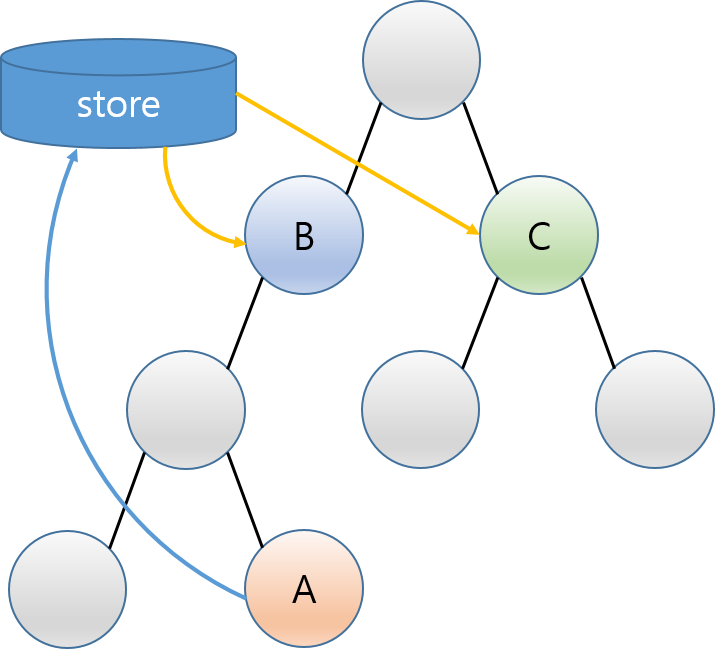

# 포켓몬 위키 웹사이트 만들기

1. 웹개발의 프로세스
2. 스벨트, 스벨트킷의 테크닉
    - page route, api route, SSR(서버 사이드 렌더링)
    - svelte store, reactivity, 검색, 필터링
3. 디자인: tailwindcss(css framework) 사용법

- 포켓몬 API: https://pokeapi.co/
    - https://pokeapi.co/api/v2/pokemon

## 1. 프로젝트 셋업

- tailwindcss svelteKit: https://tailwindcss.com/docs/guides/sveltekit

tailwindcss 설치

```bash
$ npm install -D tailwindcss postcss autoprefixer
$ npx tailwindcss init -p
```

## 2. 사이트 초반 작업

- 타이틀
- 메인페이지 꾸미기
- 네비게이션
- About 페이지

## 3. poke API 에서 데이터 가져오기

- poke API: https://pokeapi.co/api/v2/pokemon

아래의 SvelteKit Loading Data를 사용하지
않고 [Promise.all()](https://developer.mozilla.org/ko/docs/Web/JavaScript/Reference/Global_Objects/Promise/all) 사용

- Loading Data: https://kit.svelte.dev/docs/load

Store에 데이터를 저장하여 모든 컴포넌트에서 사용할 수 있도록 구현


150개의 Pokemon 데이터 가져오기

```JSON
GET https://pokeapi.co/api/v2/pokemon?limit=150
```

## 4. 포켓몬 한국어 이름 가져오기

포켓몬 정보 데이터 가져오기

```JSON
GET https://pokeapi.co/api/v2/pokemon-species
```

포켓몬 정보에서 한국어 이름을 추출해서 가져옴

## 5. 포켓몬 카드 컴포넌트 만들기

tailwindcss 카드 컴포넌트 적용

## 6. 검색창 구현

- [`$`를 사용한 reactive 검색 구현 참고](https://svelte.dev/docs/svelte-components#script-3-$-marks-a-statement-as-reactive)

## 7. 포켓몬 상세페이지 구현

`+page.js`로 API 데이터 Load 및 Store 데이터를 가져와서 구현

## 8. 스벨트 애니메이션

- **fade** 효과 적용
    - https://svelte.dev/docs/svelte-transition#fade